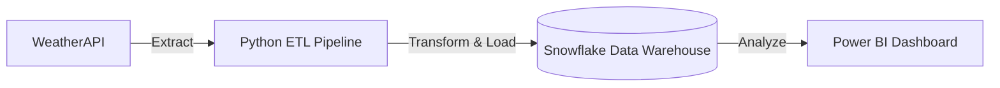

# 🌦️ Real-Time Weather Analytics Pipeline using Snowflake & Power BI

> A modern end-to-end weather analytics project that combines real-time API ingestion, cloud data warehousing, ETL processing, and interactive business intelligence visualization.

This project fetches live weather and air quality data from **WeatherAPI**, processes it using **Python ETL pipelines**, stores it in **Snowflake**, and visualizes insights through an interactive **Power BI dashboard**.

---

## 🚀 Project Architecture



---

## 📊 Dashboard Preview

### Main Dashboard Features
*   **Real-Time Temperature Monitoring**
*   **AQI & Pollution Analysis**
*   **Forecast Trends**
*   **Rain Probability Insights**
*   **Wind Speed, Humidity & Pressure Monitoring**
*   **Sunrise & Sunset Tracking**

---

## ✨ Key Features

*   🔄 **Real-time Weather API Integration**
*   ☁️ **Snowflake Cloud Data Warehouse Integration**
*   🐍 **Python-based ETL Pipeline**
*   📈 **Interactive Power BI Dashboard**
*   🌍 **Multi-location Weather Monitoring**
*   🌫️ **Air Quality Index (AQI) Visualization**
*   📅 **Forecast Analysis & Trend Monitoring**
*   🎨 **Modern Glassmorphism UI Design**
*   ⚡ **Automated Data Refresh Workflow**
*   📊 **DAX Measures & Data Modeling**

---

## 🛠️ Tech Stack

| Technology | Purpose |
| :--- | :--- |
| **Power BI** | Dashboard & Visualization |
| **Snowflake** | Cloud Data Warehouse |
| **Python** | ETL Pipeline |
| **WeatherAPI** | Real-Time Weather Data |
| **SQL** | Database Management |
| **DAX** | KPI & Analytics Calculations |

---

## 📂 Project Structure

```text
📦 Weather-Analytics-Pipeline
 ┣ 📂 Dashboard
 ┃ ┗ 📄 Weather_Dashboard.pbix
 ┣ 📂 Python_ETL
 ┃ ┗ 📄 weather_etl.py
 ┣ 📂 SQL
 ┃ ┗ 📄 snowflake_tables.sql
 ┣ 📂 Screenshots
 ┃ ┣ 📄 dashboard_preview.png
 ┃ ┣ 📄 snowflake_setup.png
 ┃ ┗ 📄 data_model.png
 ┣ 📄 README.md
 ┗ 📄 requirements.txt
```

---

## ⚙️ Snowflake Setup

### 1. Create Database & Schema
```sql
CREATE DATABASE WEATHER_DB;
USE DATABASE WEATHER_DB;

CREATE SCHEMA WEATHER_SCHEMA;
USE SCHEMA WEATHER_SCHEMA;
```

### 2. Create Weather Table
```sql
CREATE OR REPLACE TABLE CURRENT_DATA (
    CITY STRING,
    REGION STRING,
    COUNTRY STRING,
    TEMP_C FLOAT,
    FEELSLIKE_C FLOAT,
    HUMIDITY FLOAT,
    WIND_KPH FLOAT,
    PRESSURE_MB FLOAT,
    PRECIP_MM FLOAT,
    VIS_KM FLOAT,
    UV FLOAT,
    AQI_CO FLOAT,
    AQI_NO2 FLOAT,
    AQI_O3 FLOAT,
    AQI_SO2 FLOAT,
    AQI_PM2_5 FLOAT,
    AQI_PM10 FLOAT,
    LAST_UPDATED TIMESTAMP
);
```

---

## 🐍 Python ETL Workflow

The `weather_etl.py` script executes the following workflow:
1.  **Fetches** live weather data from WeatherAPI.
2.  **Extracts** essential weather & AQI metrics.
3.  **Connects** securely to the Snowflake data warehouse.
4.  **Inserts** the processed records into cloud tables.
5.  **Enables** real-time analytics for Power BI downstream.

---

## 📈 Power BI Features

*   **Dynamic KPI Cards:** Quick overview of critical metrics.
*   **Forecast Trend Analysis:** Line charts tracking temperature and precipitation.
*   **AQI Monitoring:** Gauge charts for pollution levels.
*   **Interactive Filters:** Slicers for location and time-based filtering.
*   **Location-based Insights:** Map visuals for geographical weather tracking.
*   **Custom DAX Measures:** Complex calculations for rolling averages and KPIs.
*   **Glassmorphism UI Design:** Modern, sleek, and user-friendly interface.

---

## 📌 Business Use Cases

*   **Environmental Monitoring:** Tracking pollution and AQI for health advisories.
*   **Weather Intelligence Reporting:** Providing actionable data for agriculture and logistics.
*   **Smart City Analytics:** Integrating climate data into urban planning.
*   **Climate Trend Visualization:** Long-term observation of weather patterns.
*   **Real-Time Data Engineering Practice:** A robust template for modern data stacks.

---

## 🎯 Learning Outcomes

This project demonstrates practical skills in:
*   Data Engineering & ETL Pipeline Development
*   Cloud Warehousing (Snowflake)
*   API Integration & Automation
*   Relational Data Modeling
*   Business Intelligence & Dashboard Design

---

## 🔥 Future Improvements

- [ ] **AWS Lambda Automation:** Serverless scheduling for the Python script.
- [ ] **Historical Weather Trend Storage:** Archiving old data for predictive modeling.
- [ ] **Streamlit Frontend Integration:** Building a lightweight web app for the data.
- [ ] **Automated Alerts:** Triggering notifications for dangerous AQI thresholds.
- [ ] **Incremental Data Loading:** Optimizing Snowflake inserts to save compute.
- [ ] **Real-Time Streaming Pipeline:** Moving from batch processing to Kafka/Spark streaming.

---

# 🎯 Why This Project

The objective of this project was to build a real-time analytics pipeline capable of ingesting, storing, processing, and visualizing live environmental data using modern cloud and BI technologies.
